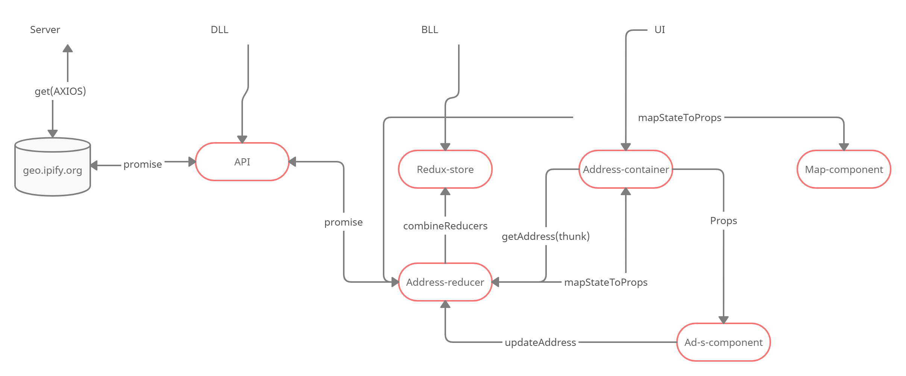

# IP ADDRESS TRACKER

Приложение предоставления данных по ip адресу.
Онлайн версия приложения(желательно открыть в инкогнито режиме) [Live version](https://ip-address-tracker-lto4b54vz.vercel.app/)

## Приложение имеет функционал;

* Автоматическое определение адреса с которого идет запрос
* Вывод на главный экран информации о заданном ip адресе(по умолчанию по адресу с которого идет запрос)
* Вывод информации на карту
* Предоставление информации по заданному ip адресу
* Соблюдены стандарты flux круговорота(каждый элемент адреса попадает в Reducer и передается на сервер из State)

## Карта приложения:

