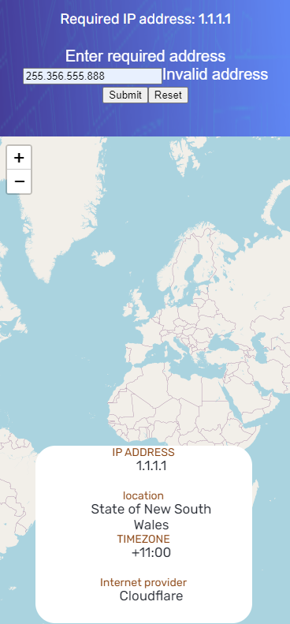

# IP ADDRESS TRACKER

Приложение предоставления данных по ip адресу.
Онлайн версия приложения: [Live version](https://ip-address-tracker-pied-six.vercel.app/)
В некоторых случаях запрос к geo.ipify.org может быть заблокирован блокировщиком рекламы. Необходимо добавить в исключения или открыть в инкогнито.

## Приложение имеет функционал;

* Автоматическое определение адреса с которого идет запрос
* Вывод на главный экран информации о заданном ip адресе(по умолчанию по адресу с которого идет запрос)
* Вывод информации на карту
* Предоставление информации по заданному ip адресу
* Соблюдены стандарты flux круговорота

## Информация о публичной службе DNS CloudFlare:

## Курсор убран с области ввода. Сообщение о необходимости ввести адрес:

## Введенный адрес превышает диапазон в IP V4. Пример для мобильной версии приложения:

